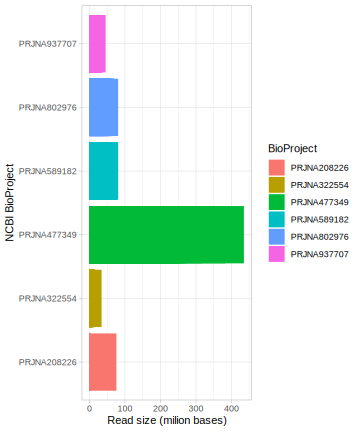
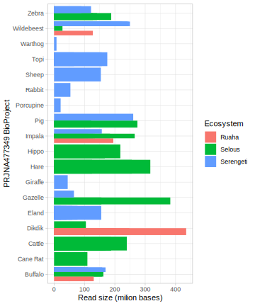
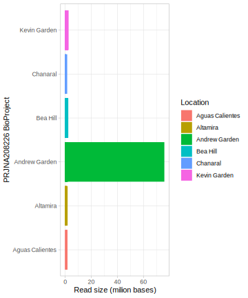

# Exploring Sample Metadata

## Load required libraries
```{r message=FALSE, warning=FALSE}
library(tidyverse)
knitr::opts_chunk$set(comment = NA)
```


## Read size
The size of the reads can tell us how big is the dataset and can help to estimate the computational needs.

Top five smallest project by read size
```{r}
read_csv("results/read_size_asc.csv", show_col_types = FALSE) %>% 
head(5)
```

Top five biggest project by read size
```{r}
read_csv("results/read_size_desc.csv", show_col_types = FALSE) %>% 
head(5)
```

## Compare read size by BioProject



<br>

## Read size by variables within a project



<br>



<br>

# (PART) SAMPLE LOCATIONS {-}
# Interactive Sample Location Map

In this section, an interactive map is provided to facilitate exploration of sample locations based on their coordinates. You can drop pins on the map if you have coordinate data, such as latitudes and longitudes of collection points. These pins can represent different projects or any user-selected metadata.


## Python Code to Generate the Sample Location Map

To generate the sample location map, first, ensure you have the `folium` package installed. You can install it using pip:

```bash
pip install folium

```

This Python code below utilizes Pandas to read metadata from a CSV file, creates a base map using Folium, and adds markers for each sample location. The resulting interactive map is saved as `sample_gps.html` in the `map` directory.


```python
import pandas as pd
import folium # Creates Web Maps from your data. On the command line 'pip install folium' if not installed yet.
import subprocess
import platform

# Read the DataFrame from your file (replace 'your_file.csv' with your actual file path)
df = pd.read_csv('data/metadata.csv')

# Create a base map
sample_gps = folium.Map(location=[df['latitude'].mean(), df['longitude'].mean()], zoom_start=1, tiles="cartodb positron")

# Add markers for each row in the DataFrame
for _, row in df.iterrows():
    folium.Marker(
        location=[row['latitude'], 
                  row['longitude']],
                  popup=f"Run: {row['run']}\nBioproject: {row['bioproject']}\nType: {row['type']}\nOrganism: {row['organism']}\nBases: {row['bases']}",
                  fill_color="RdYlGn_r",
                  fill_opacity=0.8,
                  line_opacity=0.3,
                  nan_fill_color="white",
                  legend_name="SRA Sample Metadata Analysis",
                  name="SRA sample locations",
                  ).add_to(sample_gps)

# Save the map
sample_gps.save("map/sample_gps.html")

```

## R code to display the map

To visualize the sample locations based on their coordinates, we can embed the interactive map generated by the Python code using the `htmltools` library in R.


```{r results='asis'}
library(htmltools)

HTML('<iframe src="map/sample_gps.html" width="700" height="600"></iframe>')

```

> Note: Clicking or hovering over a pin will reveal information about the associated project, offering essential context for each location. 

> It's advisable to document coordinates during sample collection to accurately plot location points, thereby enhancing the report's clarity and facilitating data interpretation.

For a complete interactive experience, please view this report in a JavaScript-supported browser. Additionally, you can utilize the zoom function for closer examination and detailed analysis of the sample locations


