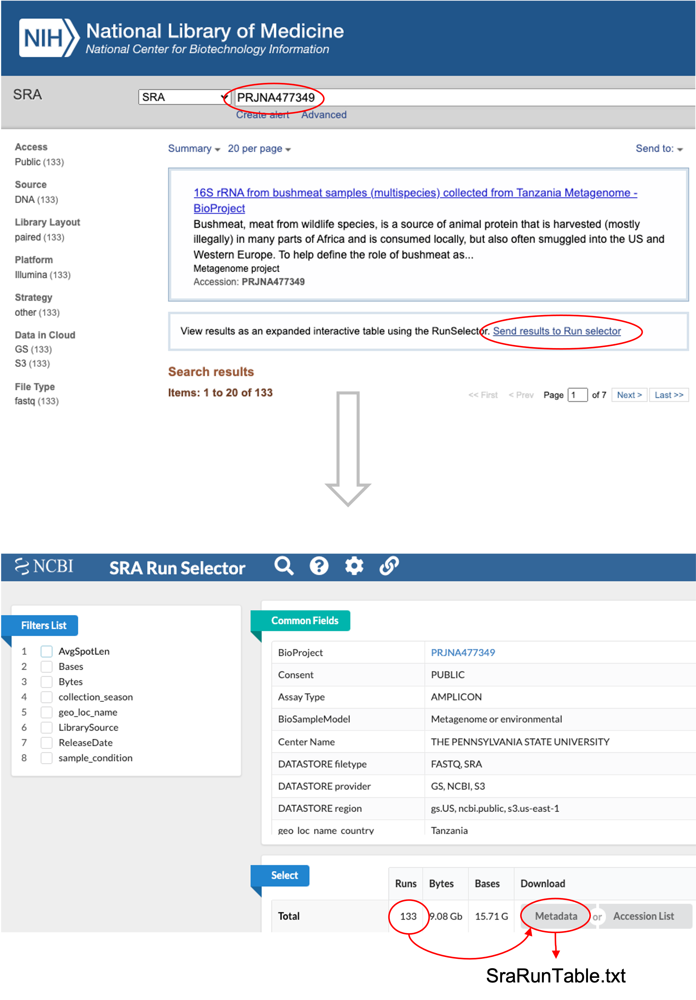

# Downloading NCBI-SRA metadata

Different methods exist for downloading sample metadata deposited in the Sequence Read Archive (SRA) or the European Nucleotide Archive (ENA). Each process yields slightly different information, so it is an ideal habit to explore which method gives you what suits you best.
For demo: We will explore more on sample metadata retrieved from five randomly selected microbiome BioProjects, including: 

1. [PRJNA477349](https://www.ncbi.nlm.nih.gov/sra/?term=PRJNA477349): 16S rRNA from bushmeat samples collected from Tanzania Metagenome (Multispecies). 
2. [PRJNA802976](https://www.ncbi.nlm.nih.gov/sra/?term=PRJNA802976): Changes to Gut Microbiota following Systemic Antibiotic Administration in Infants (Multispecies). 
3. [PRJNA322554](https://www.ncbi.nlm.nih.gov/sra/?term=PRJNA322554): The Early Infant Gut Microbiome Varies In Association with a Maternal High-fat Diet (Multispecies).
4. [PRJNA937707](https://www.ncbi.nlm.nih.gov/sra/?term=PRJNA937707): Microbiome associated with spotting disease in the purple sea urchin (Multispecies).
5. [PRJNA589182](https://www.ncbi.nlm.nih.gov/sra/?term=PRJNA589182): 16S rDNA gene sequencing of the phyllosphere endophytic bacterial communities colonizing wild Populus trichocarpa Raw sequence reads(Multispecies).


## Manually via SRA `Run Selector`
We can manually retrieve metadata from the SRA database via the `SRA Run Selector`. 

- Note that the SRA filename for metadata is automatically named SraRunTable.txt.
- Users can change the default TXT extension to like CSV if preferred.
- In our demo, we will use CSV to save the metadata file in the `data/` folder.

{#runselector}


## Computationally via `Entrez Direct`
```bash
#!/bin/bash

esearch -db sra -query 'PRJNA477349[bioproject]' | efetch -format runinfo >data/runinfo_PRJNA477349_metadata.csv;
esearch -db sra -query 'PRJNA802976[bioproject]' | efetch -format runinfo >data/runinfo_PRJNA802976_metadata.csv;
esearch -db sra -query 'PRJNA322554[bioproject]' | efetch -format runinfo >data/runinfo_PRJNA322554_metadata.csv;
esearch -db sra -query 'PRJNA937707[bioproject]' | efetch -format runinfo >data/runinfo_PRJNA937707_metadata.csv;
esearch -db sra -query 'PRJNA589182[bioproject]' | efetch -format runinfo >data/runinfo_PRJNA589182_metadata.csv;
```

## Computationally using `pysradb`

### Create pysradb environment
The `pysradb` tool can obtain metadata from SRA and ENA. Here we will create an independent environment and install pysradb. We can delete this env when no longer needed.
To learn more [click here](https://saket-choudhary.me/pysradb/quickstart.html).

- First, we create a `pysradb environment` and install the pysradb tool.
- Then we use `pysradb` to download the SRA metadata on CLI.

```bash
conda activate base
conda create -c bioconda -n pysradb PYTHON=3 pysradb
```

### Using a `bash` script
```bash
#!/bin/bash
# Shell script: workflow/scripts/pysradb_sra_metadata.sh

pysradb metadata PRJNA477349 --detailed >data/PRJNA477349_pysradb.csv
pysradb metadata PRJNA802976 --detailed >data/PRJNA802976_pysradb.csv
pysradb metadata PRJNA322554 --detailed >data/PRJNA322554_pysradb.csv
pysradb metadata PRJNA937707 --detailed >data/PRJNA937707_pysradb.csv
pysradb metadata PRJNA589182 --detailed >data/PRJNA589182_pysradb.csv
```

### Using a `python` script
```python
# Python script: workflow/scripts/pysradb_sra_metadata.py

import os
import sys
import csv
import pandas as pd

from pysradb.sraweb import SRAweb

db = SRAweb()
df = db.sra_metadata('PRJNA477349', detailed=True)
df.to_csv('data/PRJNA477349_pysradb_metadata.csv', index=False)

db = SRAweb()
df = db.sra_metadata('PRJNA802976', detailed=True)
df.to_csv('data/PRJNA802976_pysradb_metadata.csv', index=False)

db = SRAweb()
df = db.sra_metadata('PRJNA322554', detailed=True)
df.to_csv('data/PRJNA322554_pysradb_metadata.csv', index=False)

db = SRAweb()
df = db.sra_metadata('PRJNA937707', detailed=True)
df.to_csv('data/PRJNA937707_pysradb_metadata.csv', index=False)

db = SRAweb()
df = db.sra_metadata('PRJNA589182', detailed=True)
df.to_csv('data/PRJNA589182_pysradb_metadata.csv', index=False)
```
> I sometimes experience ConnectionError when using python method. Try a different method if that happens.


## Example querying SRA or ENA with a keyword
> Using keywords to search any extensive database helps filter user-specified information, such as certain disease-related studies. 

```bash
#!/bin/bash
mamba install -c bioconda pysradb

pysradb search --db sra -q Amplicon --max 100 >sra_amplicon_studies.csv

pysradb search --db ena -q Amplicon --max 100 >ena_amplicon_studies.csv
```
