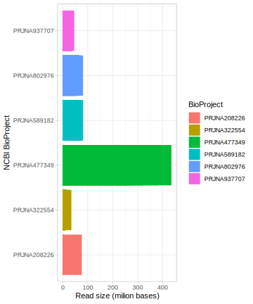
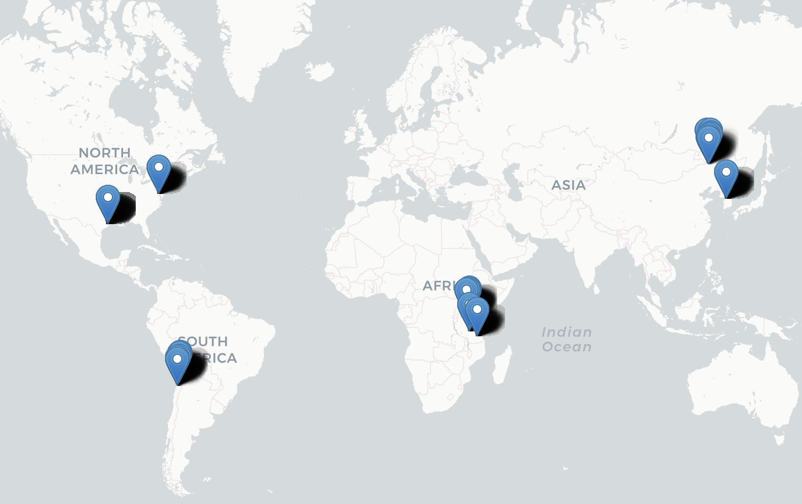

# Exploring sample metadata


```r
library(tidyverse)
knitr::opts_chunk$set(comment = NA)
```


## Read size
The size of the reads can tell us how big is the dataset and can help to estimate the computational needs.

Top five smallest project by read size

```r
read_csv("results/read_size_asc.csv", show_col_types = FALSE) %>% 
head(5)
```

```
# A tibble: 5 × 3
  run        bioproject   bases
  <chr>      <chr>        <dbl>
1 SRR3725509 PRJNA322554    581
2 SRR901080  PRJNA208226  89298
3 SRR3725412 PRJNA322554 100541
4 SRR901106  PRJNA208226 114181
5 SRR3725402 PRJNA322554 117824
```

Top five biggest project by read size

```r
read_csv("results/read_size_desc.csv", show_col_types = FALSE) %>% 
head(5)
```

```
# A tibble: 5 × 3
  run         bioproject      bases
  <chr>       <chr>           <dbl>
1 SRR10245303 PRJNA477349 434919320
2 SRR10245294 PRJNA477349 382616209
3 SRR10245352 PRJNA477349 316807915
4 SRR10245293 PRJNA477349 274398756
5 SRR10245330 PRJNA477349 265408834
```

## Compare read size by BioProject



<br>

## Read size by variables within a project


<br>


<br>

## Interactive Sample GPS Map

Dropping pins on the map is possible if you have coordinate data, such as latitudes and longitudes of collection points. The pins represent different projects, and by hovering over a pin, you will be able to see information about the corresponding project.

Below is the interactive map:


*Note: For the interactive experience, view this report in a browser that supports JavaScript.*




<br>
