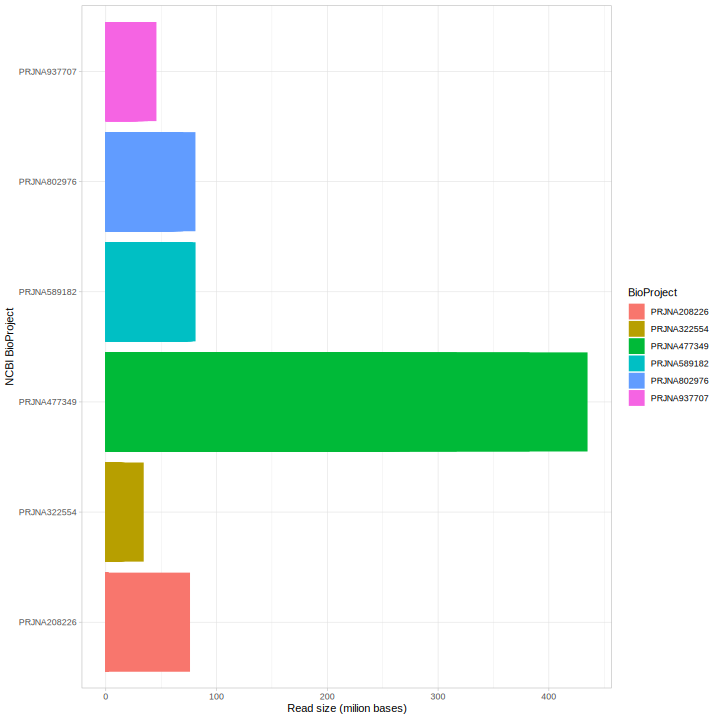
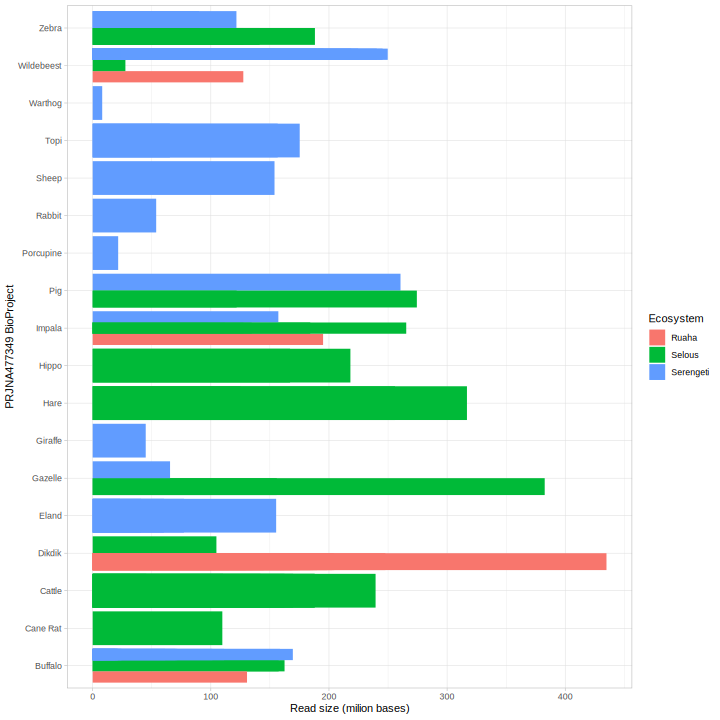
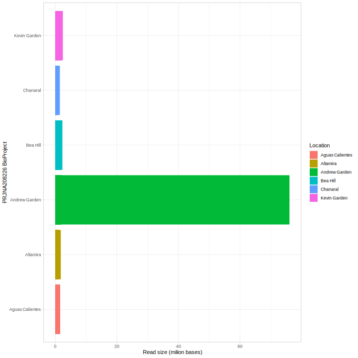
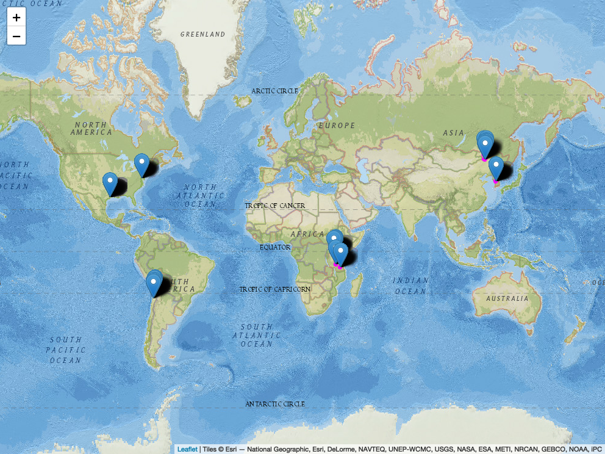

# Exploring sample metadata


```r
library(tidyverse)
knitr::opts_chunk$set(comment = NA)
```


## Read size
The size of the reads can tell us how big is the dataset and can help to estimate the computational needs.

Top five smallest project by read size

```r
read_csv("results/read_size_asc.csv", show_col_types = FALSE) %>% 
head(5)
```

```
# A tibble: 5 × 3
  run        bioproject   bases
  <chr>      <chr>        <dbl>
1 SRR3725509 PRJNA322554    581
2 SRR901080  PRJNA208226  89298
3 SRR3725412 PRJNA322554 100541
4 SRR901106  PRJNA208226 114181
5 SRR3725402 PRJNA322554 117824
```

Top five biggest project by read size

```r
read_csv("results/read_size_desc.csv", show_col_types = FALSE) %>% 
head(5)
```

```
# A tibble: 5 × 3
  run         bioproject      bases
  <chr>       <chr>           <dbl>
1 SRR10245303 PRJNA477349 434919320
2 SRR10245294 PRJNA477349 382616209
3 SRR10245352 PRJNA477349 316807915
4 SRR10245293 PRJNA477349 274398756
5 SRR10245330 PRJNA477349 265408834
```

## Compare read size by BioProject



<br>

## Read size by variables within a project



<br>



<br>

## Explore project sampling points
> Dropping pins on the map is posible if you have coordinate data, the latitudes and longitude of collection points.
> By hovering on the pin you will be able to see the corresponding project, when viewed interactively.



<br>
