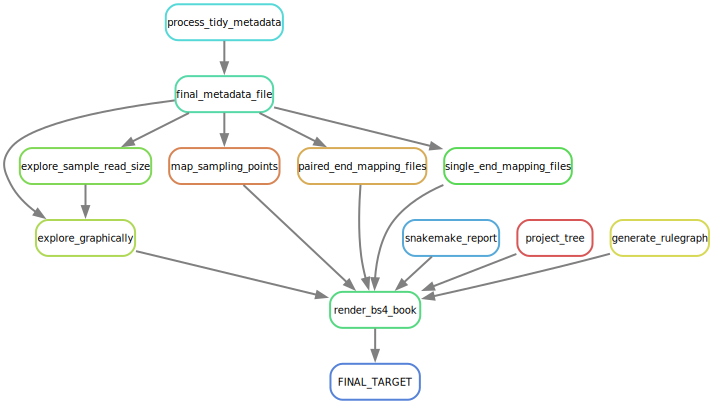

# (APPENDIX) APPENDIX {-}

# IMAP GitHub Repos

<div class="tmbinfo">
<table>
<colgroup>
<col width="29%" />
<col width="36%" />
<col width="33%" />
</colgroup>
<thead>
<tr class="header">
<th>IMAP-Repo</th>
<th>Description</th>
<th>GH-Pages</th>
</tr>
</thead>
<tbody>
<tr class="odd">
<td><a
href="https://github.com/datainsights/imap-project-overview/">OVERVIEW</a></td>
<td>IMAP project overview</td>
<td><a
href="https://tmbuza.github.io/imap-project-overview/">Link</a></td>
</tr>
<tr class="even">
<td><a href="https://github.com/tmbuza/imap-software-requirements/">PART
01</a></td>
<td>Software requirement for microbiome data analysis with Snakemake
workflows</td>
<td><a
href="https://tmbuza.github.io/imap-essential-software/">Link</a></td>
</tr>
<tr class="odd">
<td><a href="https://github.com/tmbuza/imap-sample-metadata/">PART
02</a></td>
<td>Downloading and exploring microbiome sample metadata from SRA
Database</td>
<td><a
href="https://tmbuza.github.io/imap-sample-metadata/">Link</a></td>
</tr>
<tr class="even">
<td><a href="https://github.com/tmbuza/imap-download-sra-reads/">PART
03</a></td>
<td>Downloading and filtering microbiome sequencing data from SRA
database</td>
<td><a
href="https://tmbuza.github.io/imap-download-sra-reads/">Link</a></td>
</tr>
<tr class="odd">
<td><a href="https://github.com/tmbuza/imap-read-quality-control/">PART
04</a></td>
<td>Quality Control of Microbiome Next Generation Sequencing Reads</td>
<td><a
href="https://tmbuza.github.io/imap-read-quality-control/">Link</a></td>
</tr>
<tr class="even">
<td><a href="https://github.com/tmbuza/imap-bioinformatics-mothur/">PART
05</a></td>
<td>Microbial profiling using MOTHUR and Snakemake workflows</td>
<td><a
href="https://tmbuza.github.io/imap-mothur-bioinformatics/">Link</a></td>
</tr>
<tr class="odd">
<td><a href="https://github.com/tmbuza/imap-bioinformatics-qiime2/">PART
06</a></td>
<td>Microbial profiling using QIIME2 and Snakemake workflows</td>
<td><a
href="https://tmbuza.github.io/imap-qiime2-bioinformatics/">Link</a></td>
</tr>
<tr class="even">
<td><a href="https://github.com/tmbuza/imap-data-processing/">PART
07</a></td>
<td>Processing Output from 16S-Based microbiome bioinformatics
pipelines</td>
<td><a
href="https://tmbuza.github.io/imap-data-preparation/">Link</a></td>
</tr>
<tr class="odd">
<td><a href="https://github.com/tmbuza/imap-exploratory-analysis/">PART
08</a></td>
<td>Exploratory Analysis of 16S-Based Microbiome Processed Data</td>
<td><a
href="https://tmbuza.github.io/imap-data-exploration/">Link</a></td>
</tr>
</tbody>
</table>
</div>

# Sample Metadata Rulegraph




# Session Information

Reproducibility relies on the ability to precisely recreate the working environment, and session information serves as a vital reference to achieve this consistency. Here we record details about the R environment, package versions, and system settings of the computing environment at the time of analysis. 


```r
library(sessioninfo)

# Get session info
info <- capture.output(print(session_info()))

# Exclude lines containing specific information (e.g., pandoc and library path)
info_filtered <- info[!grepl("pandoc|/Applications/RStudio.app/Contents/Resources/app/quarto/bin/tools/|/Library/Frameworks/R.framework/Versions/4.3-arm64/Resources/library|*/Users/*", info)]

# Save the filtered session info to a text file in the root directory without line numbers
cat(info_filtered, file = "session_info.txt", sep = "\n")
```


